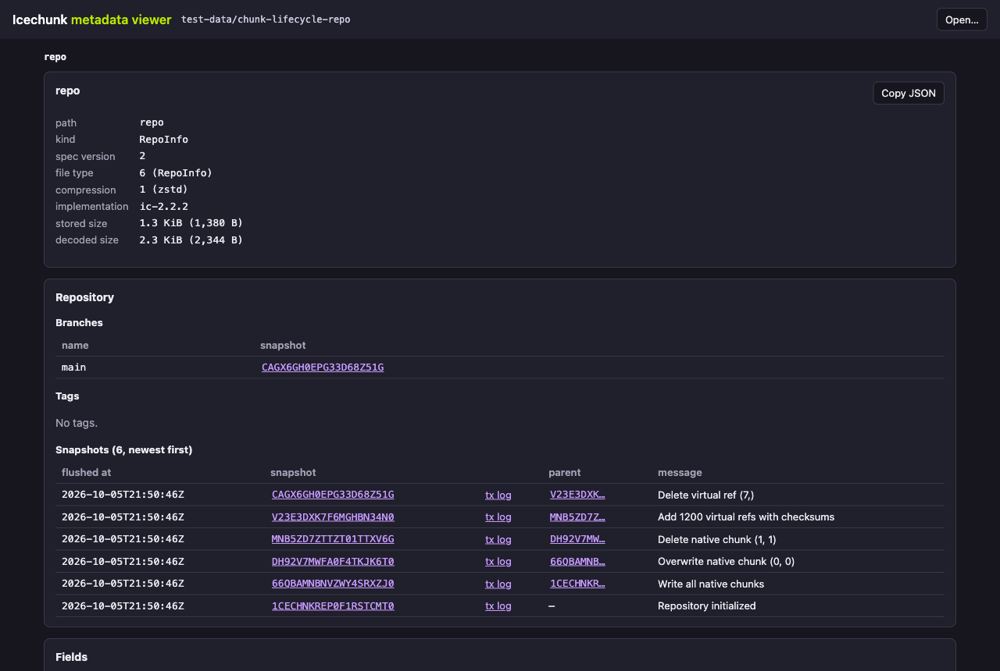
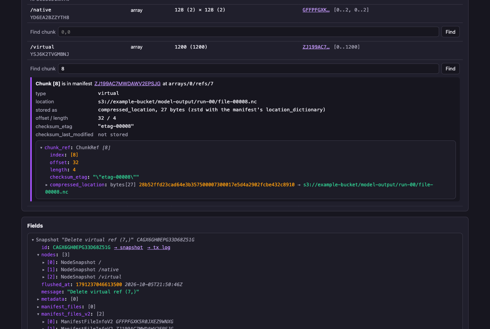

# Icechunk metadata viewer

A static web page that decodes an Icechunk V2 repository's metadata files (the repo info file, snapshots, manifests, and transaction logs) in your browser and lets you click through them. Every flatbuffer field is shown with its schema name, IDs that name other files are links, and two lookups answer format-level questions:

- **Find chunk** (on a snapshot): where is the chunk ref for these coordinates, and what does it store?
- **Classify changes** (on a transaction log): for each chunk coordinate a commit touched, was the ref added, overwritten, rewritten, or deleted?

The decoding matches `core-drill <repo> object`, `chunk-ref`, and `chunk-changes` field for field; `test/decode.test.mjs` checks this against the CLI. The page makes no requests beyond the repository you open: the zstd decoder is bundled in `vendor/zstd.js`.

## Opening the viewer



Run:

```bash
core-drill <repo> web
```

`<repo>` is anything core-drill opens: a local path, `s3://bucket/prefix`, or an Arraylake repo such as `al:org/repo`. The command serves the viewer at `http://127.0.0.1:<port>/` and opens it in your browser with that repository loaded (`--no-open` prints the address instead; `--port` picks the port). Stop it with Ctrl+C. core-drill fetches the repository's objects with its own storage access and passes them to the page, so the bucket needs no CORS setup. The other inputs stay available for opening something else.

Without core-drill, open `web/index.html` from disk (a `file://` URL). All three inputs below work there, and nothing needs installing.

## Inputs

These open a repository in the page itself, without `core-drill web`.

| Input | Use it for | Notes |
|---|---|---|
| **Local repository** | A repository on your disk | Pick the repository's root folder (the one containing `repo` and `snapshots/`). Picking a parent folder also works: the viewer uses the shallowest folder that holds a `repo` file. |
| **URL** | A repository in object storage or on a web server | Accepts `https://host/prefix/` or `s3://bucket/prefix`. An `s3://` URL becomes `https://bucket.s3.amazonaws.com/prefix/`, or `https://bucket.s3.<region>.amazonaws.com/prefix/` if you fill in the region. Requests are anonymous. |
| **Single file** | One metadata file on its own | Drop it on the page. Its kind comes from the file header. Links to other files are disabled, since there is no repository to fetch them from. |

**CORS:** for the URL input, a browser only lets the page read a bucket that allows cross-origin `GET` requests. For S3 that means a CORS rule on the bucket allowing `GET` from your origin (or `*`); without one, the page shows "could not fetch … its server must allow CORS". Local folders, single files, and `core-drill web` have no such restriction.

Navigation uses the URL fragment (`#snapshots/<id>?ctx=…&at=…`), so the browser's back and forward buttons work and a reload keeps your place. Views opened with the URL input can be shared as links (the fragment carries the source URL). Views of a local folder can't be shared, because the folder has to be picked again after a reload.

## What each page shows

Every file opens with a header summary (spec version, file type, compression, implementation, stored and decoded size) and a collapsible tree of every field. Long vectors show 50 items at a time; byte fields show a hex preview, plus their decoded form where the format defines one: FlexBuffers metadata and config as JSON, a node's Zarr metadata as JSON, and a virtual ref's `compressed_location` decompressed with the manifest's `location_dictionary`. Timestamps show their raw value and a UTC time. **Copy JSON** copies the same JSON as `core-drill <repo> --output json object <path> -n 0`.

Above the tree, each kind of file gets a summary panel:

- **repo** lists branches, tags, and every snapshot newest first, with its parent and links to its snapshot and transaction log.
- **Snapshot** shows the commit message, time, and parent, then every node. Array rows list their manifests with extents, and a **Find chunk** box.
- **Transaction log** lists each array whose chunks changed, with a **Classify changes** button.
- **Manifest** lists its arrays and says which snapshot labels the node IDs: the snapshot you navigated from, or the tip of `main`.

Node IDs (8-byte IDs) are labeled with node paths from a snapshot: a transaction log uses its own snapshot and its parent, and a manifest uses the snapshot described above.

## Walkthrough: `chunk-lifecycle-repo`

`test-data/chunk-lifecycle-repo` (generated by `scripts/create_chunk_lifecycle_repo.py`) has six commits: write four native chunks to `/native`, overwrite `(0, 0)`, delete `(1, 1)`, add 1200 virtual refs with checksums to `/virtual`, and delete virtual ref `(7)`. Open it with `core-drill test-data/chunk-lifecycle-repo web`, or pick the folder with the Local repository input.

### Which chunks changed between two versions?

1. On the **repo** page, find the commit in the snapshot list and click its **tx log** link.
2. Click **Classify changes** next to the array.

Each listed coordinate gets a kind, the parent's ref ("before"), and this commit's ref ("after"), each linking to the manifest position that holds it. The "Overwrite native chunk (0, 0)" commit shows `/native [0, 0]` as **overwritten**; "Add 1200 virtual refs with checksums" shows 1200 **added**.

The transaction log covers one commit. To compare two versions further apart, classify each commit between them.

### How does a manifest record a chunk deletion?

![Classify changes on the "Delete native chunk (1, 1)" commit: coordinate [1, 1] is deleted, with the parent manifest position and no ref after](../DOCS/images/web-viewer-classify-deletion.png)

A manifest has no entry for a deleted chunk. The transaction log lists the coordinate in `updated_chunks` without the kind of change. To see the deletion, open the transaction log of "Delete native chunk (1, 1)" and click **Classify changes**:

- The log's `updated_chunks` lists `/native` coordinate `[1, 1]`.
- The result is **deleted**: before, the parent's manifest held a native ref at `arrays/0/refs/3`; after, there is "no ref".
- Click the "before" manifest link and the "after" snapshot's manifest to compare them: the parent's manifest has four refs for `/native`, the new one three. The new manifest has no ref for `[1, 1]`.

A coordinate with no ref reads as the array's fill value. On the snapshot page, **Find chunk** with `1,1` on `/native` reports no ref.

### What checksum is stored for a virtual ref?



1. On the **repo** page, click the snapshot at the tip of `main`.
2. In the `/virtual` row, enter a coordinate in **Find chunk** and press **Find**.

The result names the manifest and position, decodes the location, and lists both checksum fields:

- Chunk `8`: `checksum_etag` is `"etag-00008"` (the quotes are part of the stored ETag); `checksum_last_modified` is not stored.
- Chunk `1`: `checksum_etag` is not stored; `checksum_last_modified` is `1717243200`, which is 2024-06-01T12:00:00Z. This field is in seconds, unlike the snapshot timestamps, which are in microseconds.

Both refs store their URL as a 27-byte `compressed_location`, which decodes to `s3://example-bucket/model-output/run-00/file-0000N.nc`. A ref has at most one of the two checksum fields. A virtual ref with neither has no stored checksum for its target object.

## Files

| File | Contents |
|---|---|
| `index.html` | Page layout and styles (light and dark) |
| `viewer.js` | UI: inputs, routing, panels, field tree |
| `decoder.js` | Pure decoding and lookup logic with no DOM access; loads in the browser (`window.IcechunkDecoder`) and in Node (`require`) |
| `schema.js` | The flatbuffer schemas as reflection JSON. Generated by `scripts/gen-schema.sh`; don't edit it. |
| `vendor/zstd.js` | The zstd decoder ([`@bokuweb/zstd-wasm`](https://www.npmjs.com/package/@bokuweb/zstd-wasm) 0.0.27) as one classic script with the wasm inlined, defining `window.IcechunkZstd`. Generated by `scripts/vendor-zstd.sh` (needs node and npm); don't edit it. |
| `test/decode.test.mjs` | Parity test against the Rust CLI |

`decoder.js` is a port of `src/raw/` and `src/fetch/raw.rs`. Change both together, and run the test.

## Testing

```bash
cargo build
node web/test/decode.test.mjs
```

The test decodes every file under `repo`, `snapshots/`, `manifests/`, `transactions/`, and `overwritten/` in the local test repositories and compares each value with `target/debug/core-drill <repo> --output json object <path> -n 0`. It also compares chunk-change classification for every commit of `chunk-lifecycle-repo` with `chunk-changes`, and a few lookups with `chunk-ref`. It uses `vendor/zstd.js`, the same decoder the page loads, so it needs no network access. The test repositories under `test-data/` are not checked in; files the CLI can't decode are reported as skipped.
